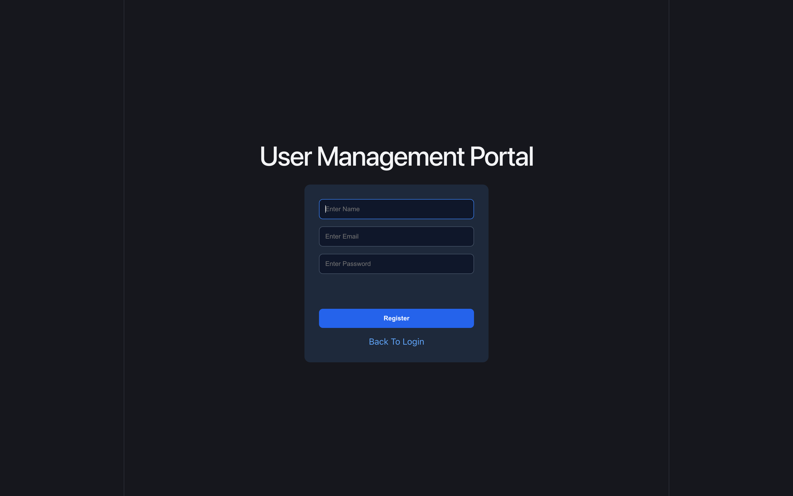
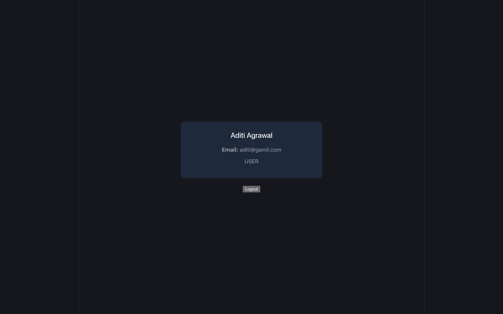
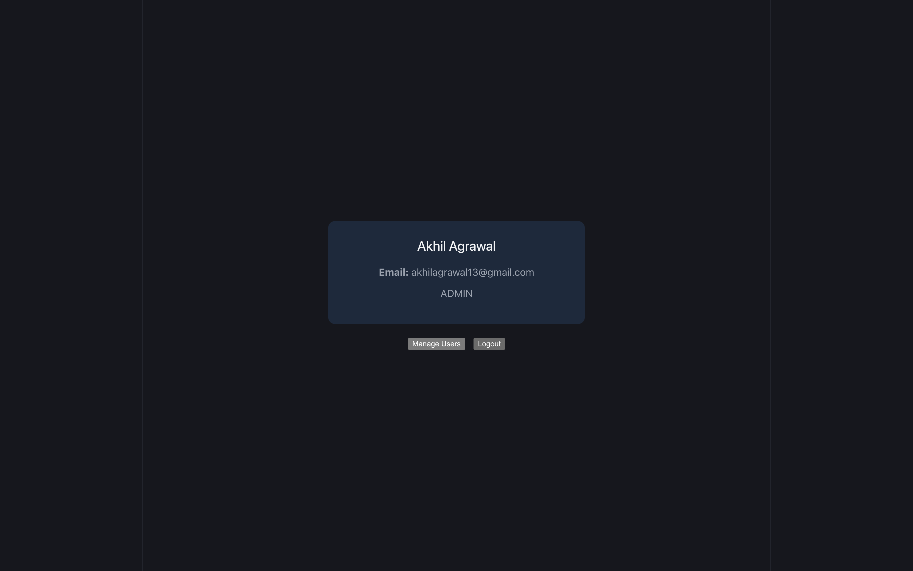

# User Management Portal Frontend

## Overview

A full-stack User Management Portal built with React, Spring Boot, JWT Authentication, MySQL, and Role-Based Access Control (RBAC).

The application supports user registration, login, secure authentication, role-based access, and complete admin user management.

---

## Live Demo

Frontend:
https://jwt-react-client.onrender.com

Backend:
https://jwtauthapi-4rsw.onrender.com

---

## Features

### Authentication

- User Registration
- User Login
- JWT Authentication
- Protected Routes
- Secure Logout

### User Dashboard

- View User Profile
- View Email
- View Role

### Admin Dashboard

- View All Users
- Search Users
- Sort Users
- Change User Roles
- Reset User Passwords
- Edit User Names
- Delete Users
- User Statistics

### Authorization

- ADMIN Role
- USER Role
- Role Based Access Control (RBAC)

---

## Frontend Tech Stack

- React
- React Router DOM
- JavaScript
- CSS
- Vite

## Backend Tech Stack

- Java
- Spring Boot
- Spring Security
- JWT
- Spring Data JPA
- Hibernate
- MySQL

---

## Screenshots

### Login Page


### Register Page



### User Dashboard



### Admin Dashboard



---

## Key Learnings

- JWT Authentication
- Spring Security
- Role Based Access Control (RBAC)
- REST API Development
- React Protected Routes
- Frontend and Backend Integration
- Deployment on Render
- Git Rebase Conflict Resolution
- Production Bug Fixing

---

## Run Locally

### Install Dependencies

```bash
npm install
```

### Start Development Server

```bash
npm run dev
```

Frontend runs on:

```text
http://localhost:5173
```

---

## Backend Repository

https://github.com/akhil4160/JwtAuthAPI

---

## Author

Akhil Agrawal

GitHub:
https://github.com/akhil4160
