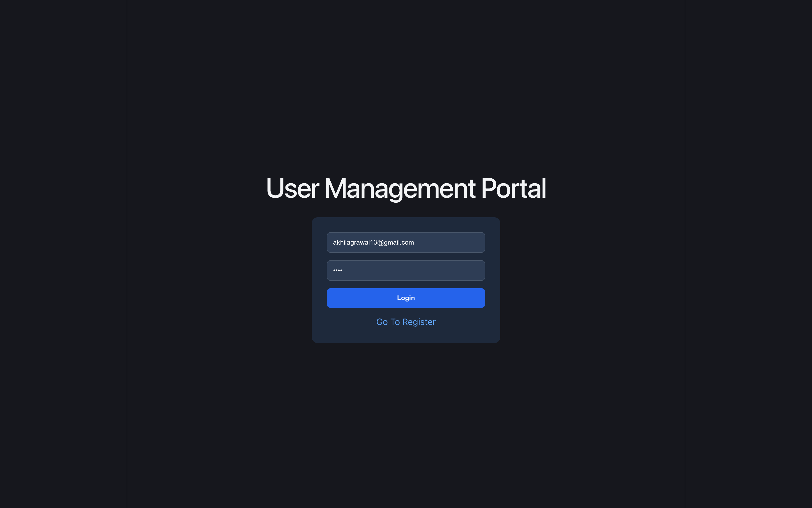

# User Management Portal Frontend

A React-based frontend application for a JWT Authentication and User Management System.

## Features

- User Registration
- User Login
- JWT Authentication
- Protected Routes
- User Dashboard
- Admin Dashboard
- Search Users
- Sort Users
- Change User Roles
- Reset User Passwords
- Delete Users
- Responsive UI

## Tech Stack

- React
- React Router DOM
- JavaScript
- CSS
- Vite

## Screenshots

### Login Page



### Register Page


### User Dashboard


### Admin Dashboard


## Run Locally

```bash
npm install
npm run dev
```

Frontend runs on:

```text
http://localhost:5173
```

## Backend Repository

Works with the JwtAuthAPI backend project.

## Author

Akhil Agrawal
